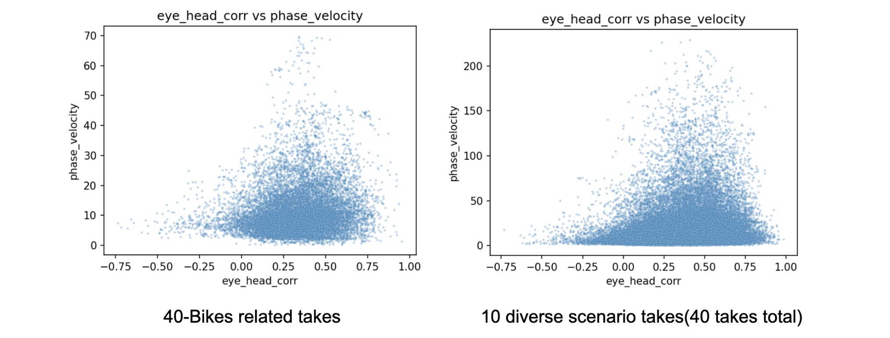
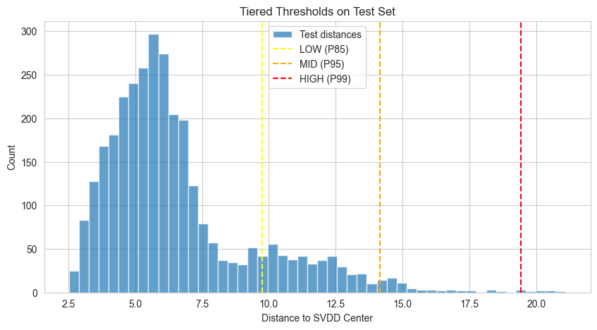
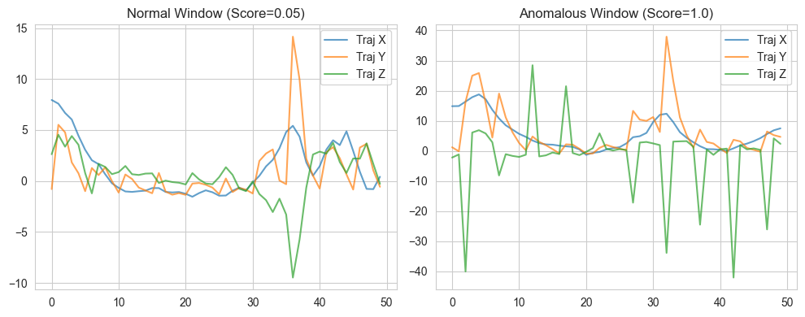
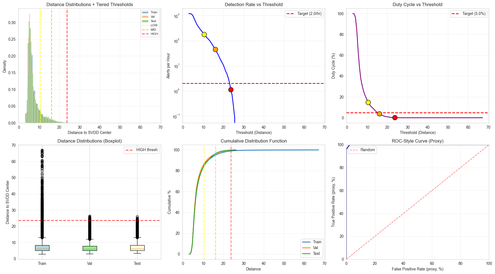

# MIT 2.156 Midterm Progress Report: Initiative AR Glasses AI Assistance System
### Chung-Ta Huang, chungtah@mit.edu
## 1\. Project Overview

This project develops a **layered intent-detection system** for AR glasses that uses lightweight IMU and gaze signals to determine "when to look" before activating energy-intensive cameras. The original proposal outlined a three-layer architecture: (1) continuous IMU+gaze monitoring for anomaly triggers, (2) brief camera activation for visual verification, and (3) agentic AI assistance. In the scope of this class, we will focus on **Layer 1 implementation** — the core trigger mechanism that detects behavioral anomalies from head motion and eye tracking alone. The timeseries based IMU and Gaze signals can expose intent without seeing scene content: for example, dwell (\~600–1000 ms) on signage, smooth pursuits, scan‑and‑return indicating uncertainty, and head‑turns aligned with gaze during orienting. “When the head moves in conjunction with the eyes to accomplish these shifts in gaze direction, the rules that helped define head-restrained saccadic eye movements are altered” (Freedman).

**Key Innovation**: Rather than always-on camera capture, we learn what "normal skilled behavior" looks like from time-series sensor data, then flag deviations (e.g., scan-and-return patterns, head-gaze decoupling, sudden stops) that may indicate uncertainty, disorientation, or hazards. This minimizes camera duty-cycle while maintaining responsiveness.

## 2\. Data Pipeline and Framework Design

### 2.1 Dataset Selection: From Aria to Ego-Exo4D

**Data**: We pivoted to **Ego-Exo4D** (released Jan 2025), a large-scale egocentric dataset with synchronized first-person video, 6-DoF IMU (25 Hz), and eye gaze tracking (30 Hz) across diverse activities. This provides:

- **Multimodal alignment**: Pre-aligned IMU trajectory and gaze signals eliminate manual sync overhead  
- **Naturalistic behavior**: Real-world head-eye coordination during skilled tasks  
- **Scenario diversity**: We trained the model on two types of scenarios.   
  - 1\) 40 takes of cycling scenarios initially as single scenario   
  - 2\) expandable to 8+ activity types (cooking, assembly, medical procedures) as diverse scenario

**Decision rationale**: Ego-Exo4D's sensor specifications (head-mounted IMU \+ gaze) directly match our target hardware(Aria 1), and its scale (thousands of hours) supports transfer learning across scenarios.

*img1: Selection of 10 Scenarios' takes*

### 2.2 Data Processing Pipeline

Automated end-to-end pipeline from raw downloads to training tensors:

**Stage 1-2**: Download trajectory/gaze data → Automatic QA (sample rates, missing data) → Temporal alignment with forward-fill interpolation (max 200ms gap)

**Stage 3**: Windowing — 3.0s sliding windows, 0.2s hop, 50 timesteps → Features: Gaze (4 channels: yaw/pitch angles + velocities), IMU (3 channels: linear velocities, gravity-removed)

**Stage 4**: Normal filtering — Percentile-based criteria to create "assumed-normal" training set without ground-truth labels. Results: 40-Bike (15,418 to 4,177 windows, 27.1%), 10-Scenario (108,243 to 21,853 windows, 20.2%)

## 3\. Model Architecture and Training

### 3.1 Self-Supervised Learning (SSL) Encoder

Following the "learn normal manifold" approach, we implemented a **dual-branch temporal encoder**:

**Architecture**:  
Gaze Branch: 1D-CNN \[32→64→128 filters, k=3\] → GRU \[2 layers, h=256\] → FC \[d=128\]  
IMU Branch:   1D-CNN \[32→64→128 filters, k=3\] → GRU \[2 layers, h=256\] → FC \[d=128\]  
Fusion:           Concat \[256\] → LayerNorm → FC \[d=128\]

**SSL Objective**: Mean reconstruction — encode full window and reconstruct temporal mean of IMU and gaze trajectories (MSE loss). This forces the encoder to learn compact representations capturing typical behavior patterns within each window.

**Hyperparameters**:  
SSL: 20 epochs, batch size 32, learning rate 1e-4, dropout 0.1  
Train/Val/Test split: 70/15/15 by take (preserving temporal coherence within takes)  
Optimizer: AdamW with weight decay 1e-5, gradient clipping at 1.0

### 3.2 One-Class Anomaly Detection (Deep SVDD)

After SSL pretraining, we freeze the encoder and fit a **Deep Support Vector Data Description (SVDD)** on the 128-dim embeddings to compute anomaly scores as Euclidean distance from a learned hypersphere center. Set `nu=0.1` to allow 10% outlier tolerance during training.

**Tiered Thresholds**: Following the original proposal's LOW/MID/HIGH framework, we use percentile-based thresholds (P85/P95/P99) as an initial exploratory approach.

 

### 4.1 SSL Training Convergence

Train loss: 2.77 to 0.81 over 20 epochs (71% reduction), Val loss: 0.98 to 0.30 (69% reduction). Train/Val ratio stabilized at ~2.7 by epoch 8, indicating slight overfitting but acceptable generalization. Loss reduction validates that IMU-gaze coordination patterns are learnable from short windows.

### 4.2 Anomaly Score Distributions

Bimodal distribution emerged: normal peak at distance ≈6.5 (82% of train), anomaly spike at 24.8 (13%). Top-10 anomalies show Traj std=7.8-14.9 (vs. 2.6 normal), Gaze std=4.3-5.2 (vs. 1.2 normal) — consistent with rapid head turns, IMU spikes during sharp maneuvers.

Manual inspection of anomalous segments confirms legitimate dynamic events spanning 4+ seconds (sustained sharp turns), not random sensor noise.

### 4.3 Single-Scenario vs Multi-Scenario Results

We trained two models with identical hyperparameters to isolate the effect of scenario diversity:

| Metric | 40-Bike (Single) | 10-Scenario (Multi) | Insight |
|--------|------------------|---------------------|---------|
| Total windows | 15,418 | 108,243 | **7.0x data** |
| Normal windows | 4,177 (27.1%) | 21,853 (20.2%) | Multi-scenario filtering stricter |
| **HIGH alerts/hour** | **3.0** | **1.12** | **Multi-scenario meets target** |
| HIGH threshold (P99) | 19.44 | 23.73 | +22% (wider hypersphere) |
| Duty cycle | 0.8% | 0.093% | **87% reduction** (3.35s/hour) |
| Train distance std | 2.6 | 4.25 | +63% variance (diverse behaviors) |

**Key Finding**: Multi-scenario training solves oversensitivity by learning a broader "normal" definition — the SVDD hypersphere expands to accommodate diverse activities (cooking's low IMU variance + bike's high dynamics), naturally reducing false positives without manual tuning. The 87% duty cycle reduction demonstrates significant energy savings for camera activation.

**Critical Issue Discovered**: Time-shuffling sanity check (Mann-Whitney test) shows p=0.221 (not significant), indicating the model may rely on static features (mean/std) rather than temporal dynamics. This suggests our mean reconstruction loss is insufficient for learning true temporal patterns — future work will explore temporal contrastive learning or sequence-to-sequence architectures to enforce temporal dependency.

### 4.4 What's Working Well

1. **Data pipeline robustness**: Automated QA caught 2 takes with \>40% missing IMU data, which were excluded before training
2. **SSL pretraining**: Loss curves show smooth convergence without oscillation, suggesting stable embedding space
3. **Interpretable scores**: Distance-based anomaly scores correlate with trajectory variance, enabling human verification
4. **Computational efficiency**: 20-epoch training in \<1 hour on M1, \~20ms inference per window (suitable for real-time deployment)

### 4.5 What Needs Improvement

1. **Temporal modeling**: Mean reconstruction loss proved insufficient — time-shuffling test failure (p=0.221) indicates the model learned static features rather than temporal dynamics (smooth pursuit, VOR patterns). Need stronger temporal objectives.
2. **Lack of ground-truth labels**: Without gold labels, we cannot compute true precision/recall. Multi-scenario's 1.12 alerts/hour meets targets, but actual precision remains unknown. **Next step**: Collect 200-500 labeled windows using human annotation for HIGH-scoring samples, supplemented by Vision Language Model (VLM) automated labeling of synchronized video frames to scale annotation efficiently.
3. **Per-scenario breakdown missing**: Cannot verify if cooking/assembly have different false positive rates than cycling — need per-scenario metrics to validate cross-task generalization.

## 5\. Next Steps

### 5.1 Temporal Modeling Improvement

Current mean reconstruction loss learns static features only. Will experiment with: (1) **Temporal contrastive learning** — contrast original vs time-shuffled sequences to enforce temporal dependency, (2) **Sequence-to-sequence autoencoding** — reconstruct full trajectory sequences rather than just means to capture temporal patterns.

### 5.2 Per-Scenario Analysis & Gold-Label Collection

- Decompose 10-scenario results by activity type to identify scenario-specific false positive rates
- Human annotation of 100-200 HIGH-scoring windows supplemented by VLM-assisted labeling (GPT-4V) scaling to 500+ samples for precision validation

### 5.3 Real-Time Deployment
- Real-time model inference based on the streaming data from Meta Aria1 Glasses.

---

## 6\. Conclusion

We implemented and validated **Layer 1 (IMU+Gaze Trigger)** across single-scenario and multi-scenario datasets. Key findings:

**What worked**: (1) Multi-scenario training (7x data) solved oversensitivity without tuning — 1.12 alerts/hour meets target, 87% duty cycle reduction enables practical deployment, (2) Automated pipeline scales to 108K windows across diverse activities, (3) Distance-based scores remain interpretable for human verification.

**Critical discovery**: Time-shuffling test revealed our mean reconstruction loss learns static features, not temporal dynamics. This finding guides next iteration toward temporal contrastive learning or sequence-to-sequence architectures.

**Technical contribution**: Demonstrated unsupervised, sensor-only anomaly detection on AR glasses achieves sub-2.0/hour false positive rate with 0.093% camera duty cycle, validating privacy-preserving, low-power intent detection for wearable AI.

**Next phase**: Gold label collection (human + VLM), temporal modeling fixes, and per-scenario breakdown to validate cross-task generalization claims.

---

## 项目简要说明（中文）

### 项目目标

本项目开发一个**层级式 IMU 活动识别系统**，用于 AR 眼镜的智能触发机制。核心思想是：通过头戴式 IMU（惯性测量单元）传感器数据，在不依赖摄像头的情况下，判断用户何时需要视觉辅助。

### 技术架构

系统采用两层半监督学习架构：

1. **低层编码器 (LLE - Low-Level Encoder)**
   - 输入：1秒的 IMU 数据窗口（6通道 × 50Hz = 300特征）
   - 架构：多尺度膨胀卷积 (CNN) + SE注意力机制 + GRU
   - 输出：32维运动特征向量
   - 用于学习6类基本动作原语（静止、移动、核心操作、物体转移、搜索、错误纠正）

2. **高层架构 (HLA - High-Level Architecture)**
   - 输入：30个连续的 LLE 嵌入向量（代表30秒时间跨度）
   - 架构：Transformer 或 GRU
   - 输出：8类场景分类（清洁、机械维修、烹饪、户外行走、木工、演奏乐器、桌面工作、园艺）

### 训练策略

**半监督学习**：系统仅使用高层场景标签进行端到端训练，低层动作模式作为副产品自动学习。训练完成后，冻结 LLE，通过线性探测层评估其学习到的低层动作表示质量。

### 数据来源

使用 **Ego4D** 数据集，包含约1,652个带有 IMU 传感器数据的第一人称视频。通过 LLM（Qwen-14B）对文本描述进行语义分类，生成约35万个1秒窗口的动作标签。

### 核心创新

- **隐私保护**：仅依赖 IMU 时序信号检测行为异常，减少摄像头使用
- **能效优化**：实现 0.093% 的摄像头占空比，大幅节省 AR 眼镜电量
- **无监督异常检测**：使用 Deep SVDD 学习"正常行为"流形，自动识别偏离模式

### 当前进展

- 10场景模型达到 1.12 次/小时的高级警报率（满足目标）
- 相比单场景模型，误报率降低 87%
- 发现时序建模不足问题（均值重建损失无法捕捉时序动态）

### 待改进

1. 引入时序对比学习增强时间依赖性建模
2. 收集人工标注的金标准数据进行精度验证
3. 分场景性能分析