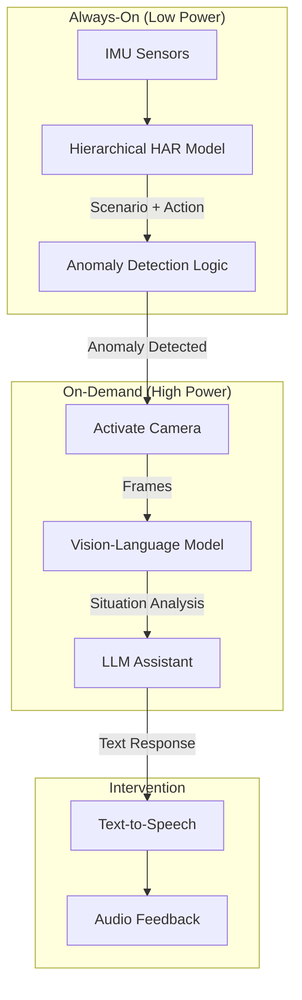

# Context-Aware Assistive AI Architecture

## 1. System Overview

The system operates as a **Hierarchical Event Triggered** pipeline. It minimizes power consumption and latency by using a lightweight IMU model as the "Gatekeeper" and only invoking heavy Visual-Language Models (VLMs) when contextually necessary.

## 2. Component Breakdown

### Stage 1: The Gatekeeper (IMU HAR)
- **Input**: 50Hz Accel/Gyro stream.
- **Model**: Your current **Hierarchical Model** (CNN-GRU/Transformer).
- **Output**: 
  - `Scenario` (e.g., Cooking) - updated every 30s.
  - `Action` (e.g., Manipulation) - updated every 1s.

### Stage 2: Anomaly Logic (The "Brain")

We propose a multi-layered approach to Anomaly Detection, ranging from simple statistics to complex sequential modeling.

#### What is `anomaly_reason`?
When the anomaly logic decides to **activate the camera / VLM**, it should also emit a small, structured explanation called `anomaly_reason`.

- **Definition**: the IMU-side reason *why* this moment was flagged (not from the VLM).
- **Purpose**:
  - Give the VLM context for verification (what looked “weird”).
  - Give the downstream LLM a grounded rationale for user-facing help.
- **Typical contents (examples)**:
  - **Contextual probability trigger**: \(P(\text{Action} \mid \text{Scenario})\) below threshold (e.g., `p=0.01 < 0.05`).
  - **Heuristic trigger**: safety rule fired (e.g., “Walking outdoors + stationary > 10s”).
  - **Pattern trigger (optional)**: unusual sequence detected (e.g., repeated `Search` 6× in `Cooking`).

#### Strategy 1: Temporal & Contextual Probability (Hard)
- **Logic**: $P(\text{Action} | \text{Scenario}, \text{Duration})$.
- **Idea**: "It is normal to stand still while cooking, but not for 20 minutes."
- **Status**: **On Hold**. Training labels are sparse/atomic (avg 1s), making duration modeling unreliable with current data.

#### Strategy 2: Contextual Probability Only (Implemented)
- **Logic**: $P(\text{Action} | \text{Scenario}) < \text{Threshold}$.
- **Idea**: "Walking while playing the piano is rare/impossible."
- **Status**: **Active**. Used as the primary baseline. 
- **Metric**: See Probability Matrix (e.g., $P < 0.05$ triggers VLM).

#### Strategy 3: Heuristic / Safety Overrides (Handmade)
- **Logic**: `if Scenario == X and Action == Y: Trigger`.
- **Idea**: Safety-critical rules that override data.
- **Example**: If `Scenario: Walking Outdoors` and `Action: Stationary` for > 10s -> **Trigger**.
    - *Reason*: Even if data says waiting at a crosswalk is "normal", a safety assistant should check if the user is lost or frozen.

#### Strategy 4: Sequential Pattern Logic (Advanced)
- **Logic**: $P(Action_t | Action_{t-1}, Action_{t-2}, Scenario)$.
- **Idea**: Detect "Loops" or "Erratic" sequences.
- **Example**: `Search` -> `Search` -> `Search` -> `Search`.
    - Normal workflow: `Search` -> `Manipulation` -> `Stationary`.
    - Confusion workflow: Repeatedly searching without performing a task.
- **Implementation**: Markov Chains or N-gram entropy analysis.

### Stage 3: Visual Verification
- **Hardware**: Smart Glasses Camera (e.g., Ray-Ban Meta, Vuzix).
- **Action**: Capture a 5-second video clip or 3 keyframes.
- **Intermediate Model (Optional)**: **YOLOv8-Nano**.
  - *Purpose*: Quick check for relevant objects (e.g., "Is there a knife?" if Cooking). Fast and cheap.

### Stage 4: Contextual Reasoning (VLM)
- **Current VLM (local)**: **Moondream2** via HuggingFace Transformers (`vikhyatk/moondream2`).
- **Other candidates**: **Qwen2-VL-7B-Instruct** (Open Source, efficient) or **GPT-4o-mini** (API, fast).
- **Prompt Strategy**:
  > "Sensor data suggests the user is [Scenario] but performing [Action], which is unusual. Look at this image. Is the user in danger, confused, or just doing something else? Reply with a JSON status."

- **Moondream2 role in this system**:
  - Use it as a **visual verifier / reporter**: given 1–3 frames, produce a short description + a small **structured JSON** verdict (OK/ANOMALY/UNCLEAR) + a **label plausibility** check (`plausible|implausible|unclear`).
  - Keep the **interactive dialog** and multi-step decision-making in a separate LLM (Stage 5), fed by the VLM JSON + IMU anomaly signals.

### Stage 5: User Intervention (LLM + TTS)
- **Model**: Same as VLM or a lightweight LLM (e.g., Llama-3-8B).
- **Task**: meaningful interaction.
- **Example**:
  - *VLM Output*: "User is staring at an empty cutting board."
  - *LLM Output*: "It looks like you're ready to chop, but I don't see any vegetables. Do you need a recipe?"

## 3. Implementation Roadmap

### Phase 1: Anomaly Definition (Software)
- [ ] Create a script `analyze_normality.py` to compute the co-occurrence matrix of (Scenario, Action) from the Training Set.
- [ ] Define thresholds for "Anomaly".

### Phase 2: Simulation (Offline)
- [ ] Create a `simulate_pipeline.py` script.
- [ ] Input: A Test Video file.
- [ ] Logic: Run HAR. If anomaly -> Extract frame at that timestamp -> Save frame as "Anomaly Candidate".

### Phase 3: VLM Integration
- [ ] Integrate a VLM API (OpenAI or Local HF Transformers).
- [ ] Send "Anomaly Candidate" frames to VLM.
- [ ] Evaluate if VLM explanation makes sense.

**Existing Moondream2 test harnesses (to iterate fast on prompts + latency):**
- `scripts/vlm_moondream2_probe.py`: full probe harness (frame extraction, multiple prompts, structured JSON, optional `--aggregate`).
- `scripts/simple_test_VLM.py`: minimal “speed test” (load model once, run one image+prompt, print timings).

### Phase 4: Real-Time Prototype
- [ ] Connect `inference_engine.py` (which we created earlier) to the Anomaly Logic.
- [ ] Mock the camera feed (or use real webcam).

