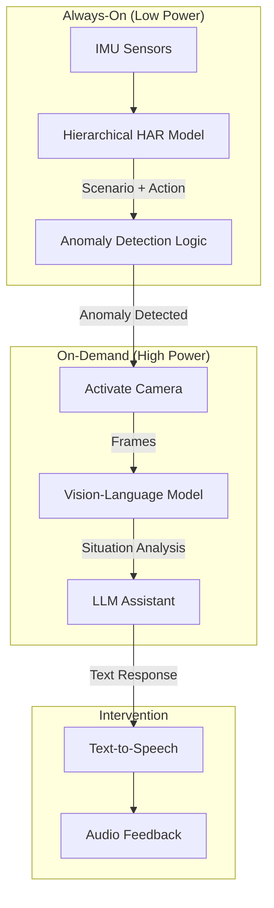

# Context-Aware Assistive AI Architecture

## 1. System Overview

The system operates as a **Hierarchical Event Triggered** pipeline. It minimizes power consumption and latency by using a lightweight IMU model as the "Gatekeeper" and only invoking heavy Visual-Language Models (VLMs) when contextually necessary.

## 2. Component Breakdown

### Stage 1: The Gatekeeper (IMU HAR)
- **Input**: 50Hz Accel/Gyro stream.
- **Model**: Your current **Hierarchical Model** (CNN-GRU/Transformer).
- **Output**: 
  - `Scenario` (e.g., Cooking) - updated every 30s.
  - `Action` (e.g., Manipulation) - updated every 1s.

### Stage 2: Anomaly Logic (The "Brain")
We need a statistical baseline of "Normalcy".
- **Logic**: Compute Conditional Probability $P(\text{Action} | \text{Scenario})$ from training data.
- **Trigger Condition**: 
  - If $P(\text{Current Action} | \text{Current Scenario}) < \text{Threshold}$ (e.g., 0.05).
  - *Example*: `Scenario: Desk Work` + `Action: Locomotion` (Running) -> **Anomaly**.
  - *Example*: `Scenario: Cooking` + `Action: Stationary` (for > 2 minutes) -> **Anomaly** (User might be confused/stuck).

### Stage 3: Visual Verification
- **Hardware**: Smart Glasses Camera (e.g., Ray-Ban Meta, Vuzix).
- **Action**: Capture a 5-second video clip or 3 keyframes.
- **Intermediate Model (Optional)**: **YOLOv8-Nano**.
  - *Purpose*: Quick check for relevant objects (e.g., "Is there a knife?" if Cooking). Fast and cheap.

### Stage 4: Contextual Reasoning (VLM)
- **Model Candidate**: **Qwen2-VL-7B-Instruct** (Open Source, efficient) or **GPT-4o-mini** (API, fast).
- **Prompt Strategy**:
  > "Sensor data suggests the user is [Scenario] but performing [Action], which is unusual. Look at this image. Is the user in danger, confused, or just doing something else? Reply with a JSON status."

### Stage 5: User Intervention (LLM + TTS)
- **Model**: Same as VLM or a lightweight LLM (e.g., Llama-3-8B).
- **Task**: meaningful interaction.
- **Example**:
  - *VLM Output*: "User is staring at an empty cutting board."
  - *LLM Output*: "It looks like you're ready to chop, but I don't see any vegetables. Do you need a recipe?"

## 3. Implementation Roadmap

### Phase 1: Anomaly Definition (Software)
- [ ] Create a script `analyze_normality.py` to compute the co-occurrence matrix of (Scenario, Action) from the Training Set.
- [ ] Define thresholds for "Anomaly".

### Phase 2: Simulation (Offline)
- [ ] Create a `simulate_pipeline.py` script.
- [ ] Input: A Test Video file.
- [ ] Logic: Run HAR. If anomaly -> Extract frame at that timestamp -> Save frame as "Anomaly Candidate".

### Phase 3: VLM Integration
- [ ] Integrate a VLM API (OpenAI or Local HF Transformers).
- [ ] Send "Anomaly Candidate" frames to VLM.
- [ ] Evaluate if VLM explanation makes sense.

### Phase 4: Real-Time Prototype
- [ ] Connect `inference_engine.py` (which we created earlier) to the Anomaly Logic.
- [ ] Mock the camera feed (or use real webcam).

