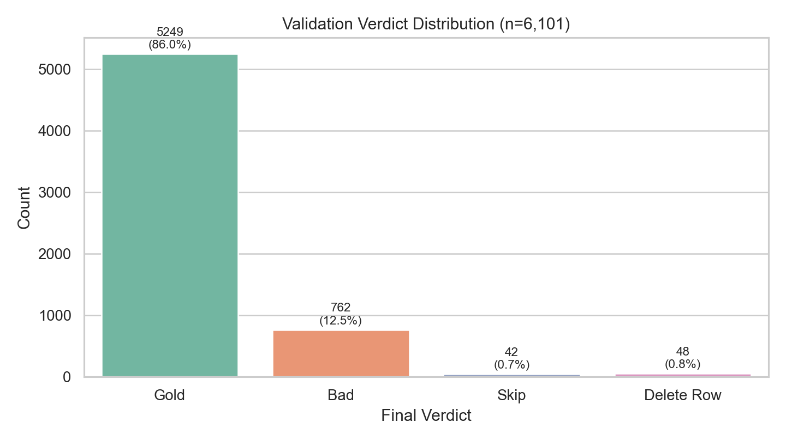
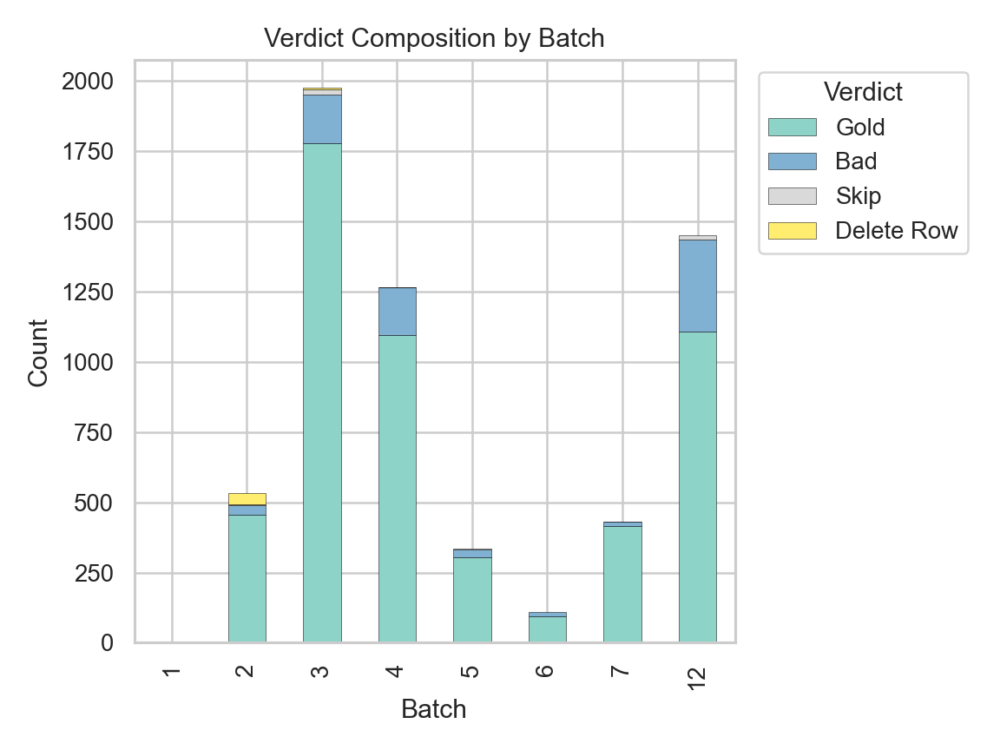
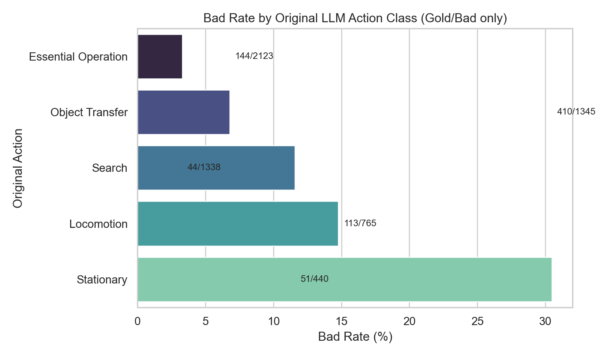
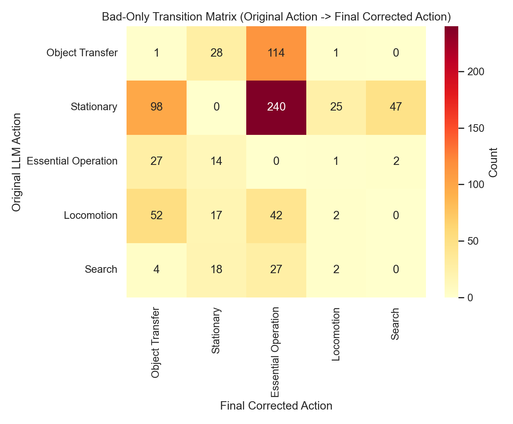
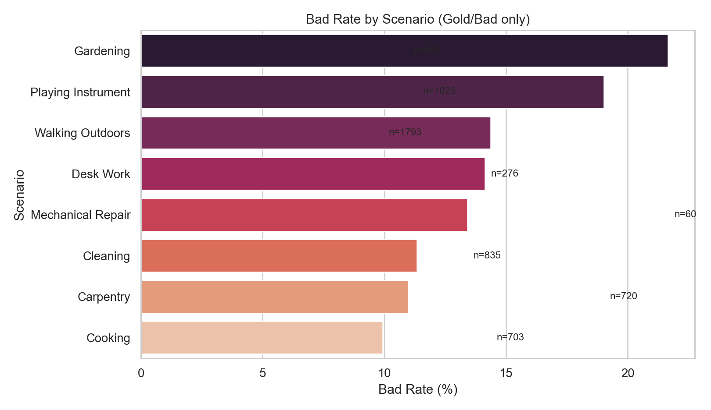
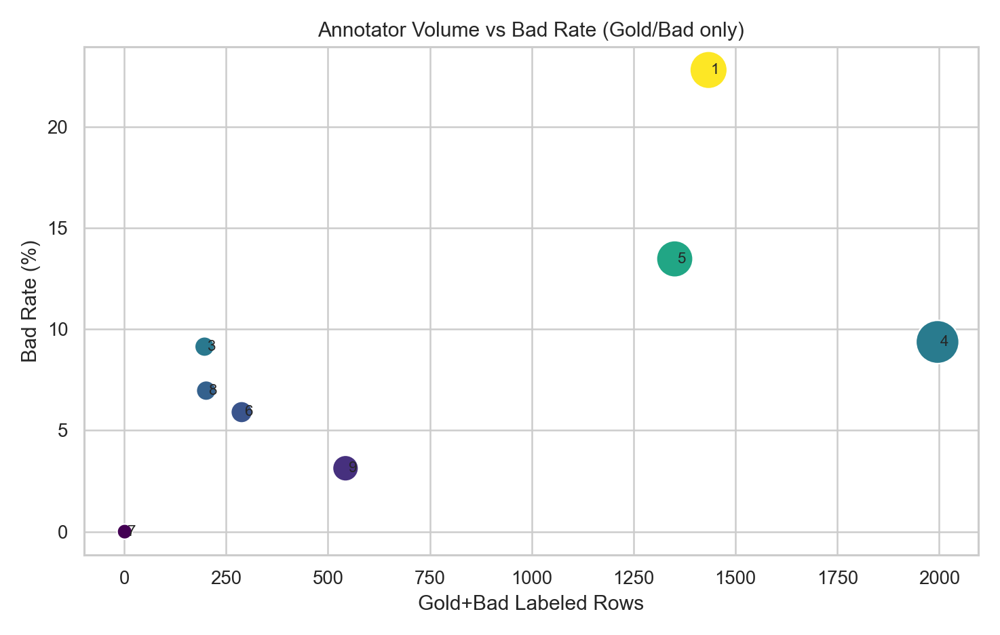
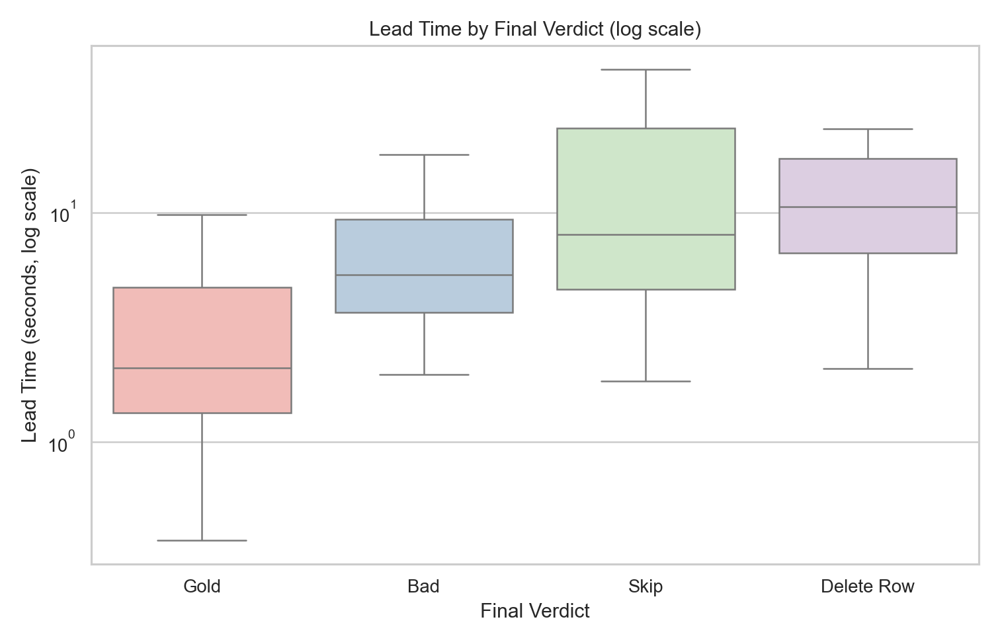
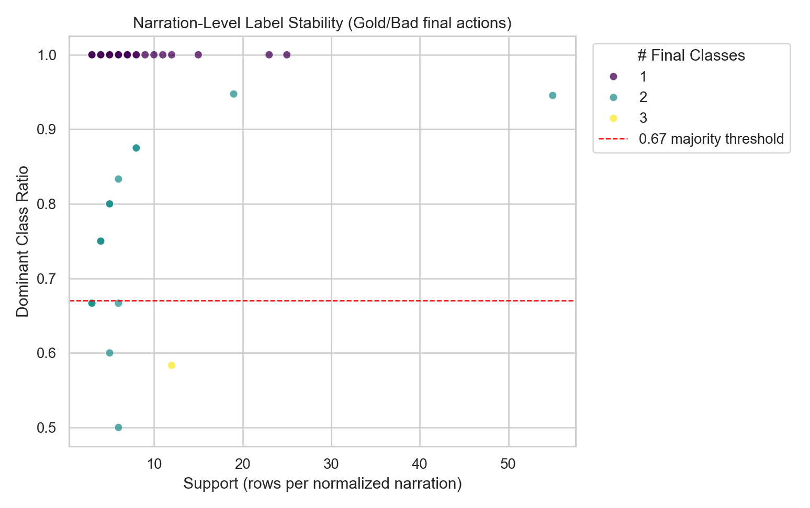
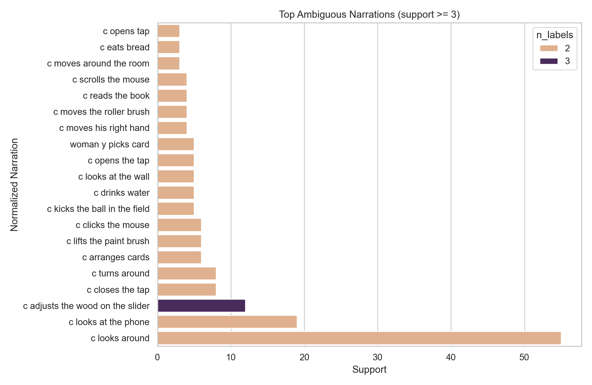
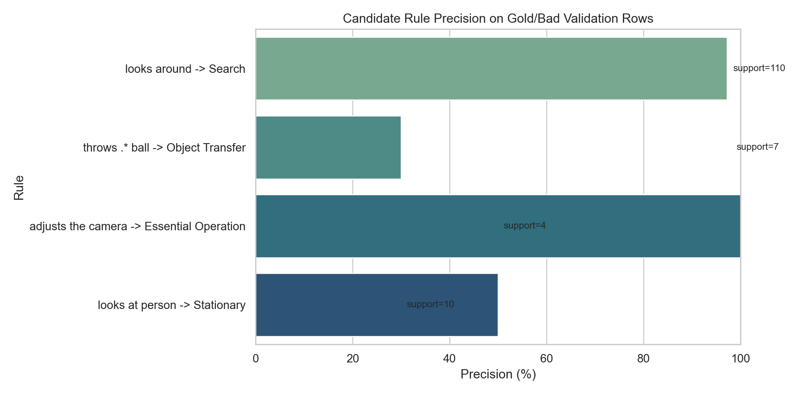

# Round-1 Validation Analysis (English)

## Scope

- Input file: `data/annotation_rounds/r001_merged_validation/round1_validated_rows_with_decisions.csv`
- Rows analyzed: `6,101`
- This report includes visualization, numerical summaries, and concrete case-level error analysis.

## Executive Summary

- Final verdict distribution: Gold `5,249`, Bad `762`, Skip `42`, Delete Row `48`.
- Gold rate among Gold+Bad: `87.32%`.
- Errors are boundary-driven (especially around `Stationary`, `Essential Operation`, and `Object Transfer`), not random noise.
- Ambiguous normalized narrations (>=2 final classes): `50` groups.
- Conservative majority policy (`support>=3`, `dominant_ratio>=0.67`) would auto-resolve `13` narration groups with an estimated `15` relabels.

## Figures

### Verdict distribution

### Verdict composition by batch

### Bad rate by original action class

### Bad-only transition matrix

### Bad rate by scenario

### Annotator volume vs bad rate

### Lead time by verdict

### Narration-level ambiguity scatter

### Top ambiguous narrations

### Candidate rule precision

## Numerical Highlights

### Highest Bad-Rate Classes

| Original Action | Gold | Bad | Bad Rate (%) |
|---|---:|---:|---:|
| Stationary | 935 | 410 | 30.48 |
| Locomotion | 652 | 113 | 14.77 |
| Search | 389 | 51 | 11.59 |
| Object Transfer | 1979 | 144 | 6.78 |
| Essential Operation | 1294 | 44 | 3.29 |

### Highest Bad-Rate Scenarios

| Scenario | Gold | Bad | Bad Rate (%) |
|---|---:|---:|---:|
| Gardening | 47 | 13 | 21.67 |
| Playing Instrument | 583 | 137 | 19.03 |
| Walking Outdoors | 602 | 101 | 14.37 |
| Desk Work | 237 | 39 | 14.13 |
| Mechanical Repair | 723 | 112 | 13.41 |

### Candidate Rule Precision (Gold/Bad rows)

| Rule | Support | Precision (%) |
|---|---:|---:|
| looks around -> Search | 110 | 97.27 |
| throws .* ball -> Object Transfer | 10 | 30.00 |
| adjusts the camera -> Essential Operation | 7 | 100.00 |
| looks at person -> Stationary | 4 | 50.00 |

## Case Analysis

### Top Error Transitions

| Transition | Count |
|---|---:|
| Stationary -> Essential Operation | 240 |
| Object Transfer -> Essential Operation | 114 |
| Stationary -> Object Transfer | 98 |
| Locomotion -> Object Transfer | 52 |
| Stationary -> Search | 47 |
| Locomotion -> Essential Operation | 42 |
| Object Transfer -> Stationary | 28 |
| Essential Operation -> Object Transfer | 27 |
| Search -> Essential Operation | 27 |
| Stationary -> Locomotion | 25 |

### Representative Cases

See `tables/case_examples_top_transitions.csv` for concrete narration-level examples, scenarios, and reasoning excerpts.

### Narration-Level Ambiguity

- High-support ambiguous narrations are captured in `tables/top_ambiguous_narrations.csv`.
- Mixed-outcome narrations (same normalized narration with multiple final classes) are in `tables/top_mixed_outcome_narrations.csv`.

## Interpretation for Next Iteration

1. Keep high-precision rules (`looks around -> Search`, `adjusts the camera -> Essential Operation`) before fine-tuning.
2. Do not hard-code low-precision rules (`looks at person -> Stationary`) without additional context features.
3. Use majority resolution only with support and dominance thresholds to avoid over-correction.
4. Prioritize targeted guideline updates for class boundaries where transitions concentrate.

## Generated Data Assets

- `tables/verdict_distribution.csv`
- `tables/batch_verdict_summary.csv`
- `tables/class_bad_rate.csv`
- `tables/bad_transition_matrix.csv`
- `tables/scenario_bad_rate.csv`
- `tables/annotator_quality_summary.csv`
- `tables/lead_time_by_verdict.csv`
- `tables/narration_ambiguity_summary.csv`
- `tables/top_ambiguous_narrations.csv`
- `tables/candidate_rule_precision.csv`
- `tables/top_bad_transitions.csv`
- `tables/case_examples_top_transitions.csv`
- `tables/top_mixed_outcome_narrations.csv`
